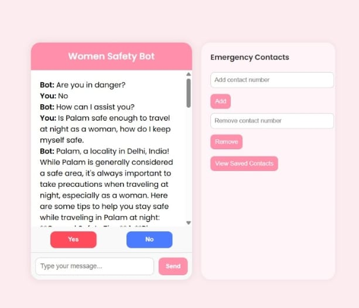

# WOMEN_SAFETY_CHATBOT


> A web-based emergency chatbot to assist women in dangerous situations by sending automatic SMS alerts with real-time location tracking.

---
### TEAM MEMBERS DETAILS

**VANSHIKA DIXIT- (2401010010)**
**SNEHA TELI GUPTA- (2401010020)**
**AADYA DIWAN- (2401010040)**
**YUKTI VADEHRA- (2401010128)**

---
### 🎥 Demo Video

[Click here to watch the demo video](visual_representation/Y1-2024-2025-G19.mp4)

---
### 🎥 Demo Video (SharePoint Link)

[Click here to watch the demo video](https://krmangalameduin-my.sharepoint.com/:v:/g/personal/harsh_vardhan_krmangalam_edu_in/EeeTuDr7K7BPrQpQXLPqPqUBDd6i-HXWsoXJTmhEQjm4Gg?e=CjlyrU)

---

### View project report

[Click here to view detailed project report](Mini_project_Report.pdf)

---

## 🌟 Features

- 🆘 **Emergency SOS Trigger** through Web Chat or Voice Command ("Help")
- 📍 **Live Location Tracking** and Google Maps Link
- 📲 **SMS Alerts** using Twilio API to multiple contacts
- 📋 **Manage Emergency Contacts** (Add / Remove Contacts)
- 🎙️ **Voice Recognition** ("Help" keyword detection)
- 🤖 **Chatbot Assistant** powered by Groq Llama3 LLM
- 🔒 **Secure Information Handling** using Flask backend

---

## 🛠️ Tech Stack

- **Python 3.8+**
- **Flask** (Backend)
- **Twilio API** (SMS service)
- **Groq API** (Chatbot AI)
- **Geocoder + Geopy** (Location tracking)
- **SQLite** (Emergency contacts database)
- **SpeechRecognition** (Voice detection)

---

## 📁 Project Structure

```

women-safety-webapp/
│
├── static/
│   └── styles.css                    # CSS styles for the web app
│
├── templates/
│   └── index.html                    # Main HTML file rendered by Flask
│
├── visual\_representation/
│   └── Y1-2024-2025-G19.mp4          # Video representation of the project
│
├── .env.example                      # Template for environment variables
├── .gitignore                        # Files and folders to be ignored by Git
├── Mini\_project\_Report.pdf           # Final report of the project
├── README.md                         # Project overview and usage instructions
├── app.py                            # Main backend Flask application
├── emergency\_contacts.db           # SQLite database storing emergency contacts
├── women safety bot presentation.pdf #Contains pdf of the ppt presented
└── requirement.txt                   # Python dependencies

```


---

## 🚀 Local Setup Guide

Follow these steps to run the project on your machine:

1. **Clone the repository**  
   ```bash
   git clone https://github.com/VANSHIKADIXIT16/WOMEN_SAFETY_CHATBOT.git
   cd WOMEN_SAFETY_CHATBOT

2. **Create a virtual environment (optional but recommended)**
   ```bash
   python -m venv venv
source venv/bin/activate  # (Linux/Mac)
venv\Scripts\activate      # (Windows)

3. **Install dependencies**
   ```bash
   pip install -r requirements.txt

4. **Set up environment variables**
   ```bash
   TWILIO_ACCOUNT_SID=your_twilio_account_sid
   TWILIO_AUTH_TOKEN=your_twilio_auth_token
   TWILIO_PHONE_NUMBER=your_twilio_phone_number
   GROQ_API_KEY=your_groq_api_key

5. **Run the Flask app**
   ```bash
   python app.py

The app will be running at: http://127.0.0.1:5000/

## 📷 Screenshots

### Chat Interface


### Contacts added


### Voice Detection


### SMS received on using Yes Button


### General assistance



